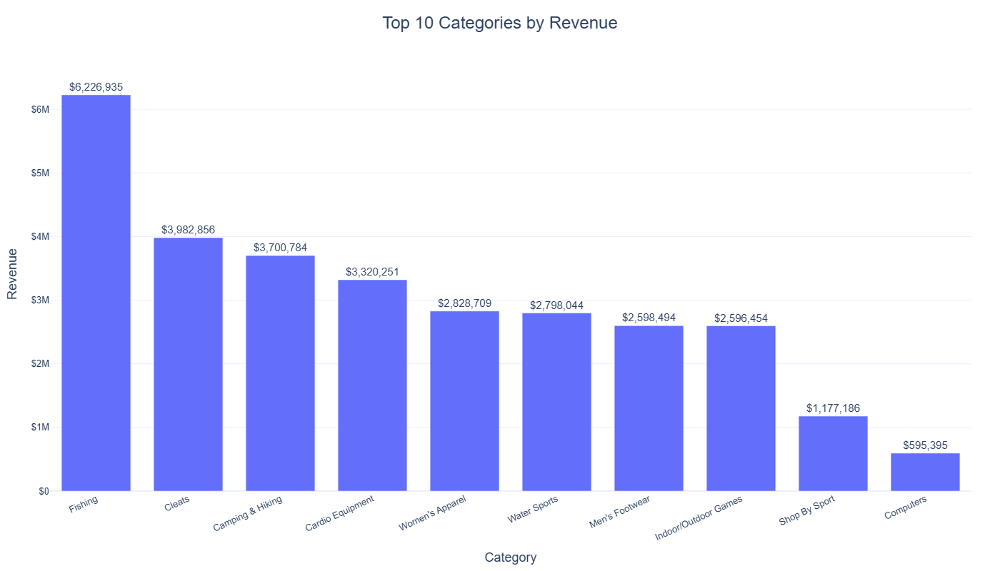
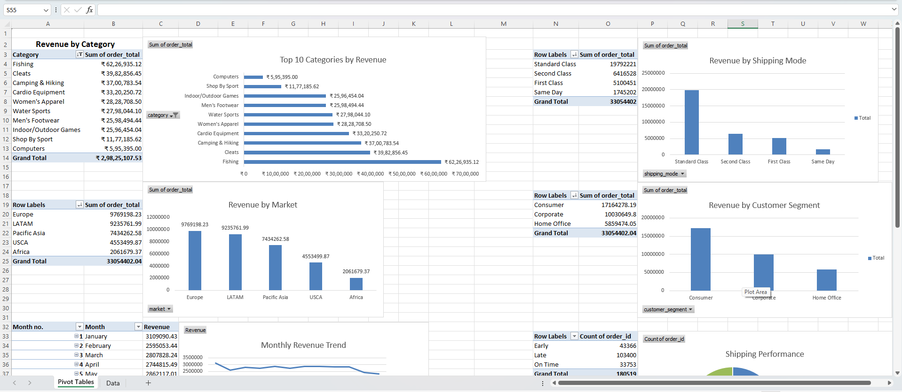
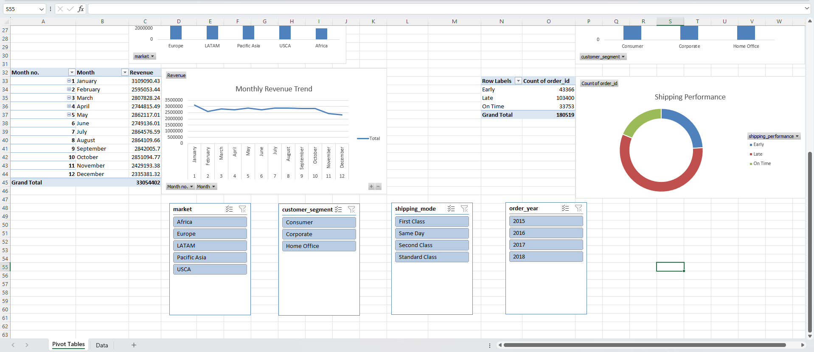
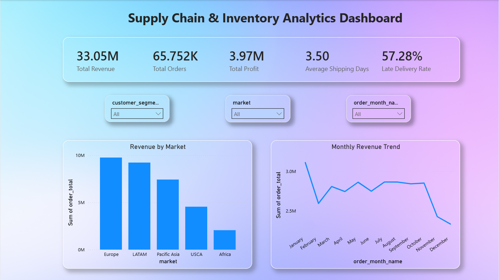
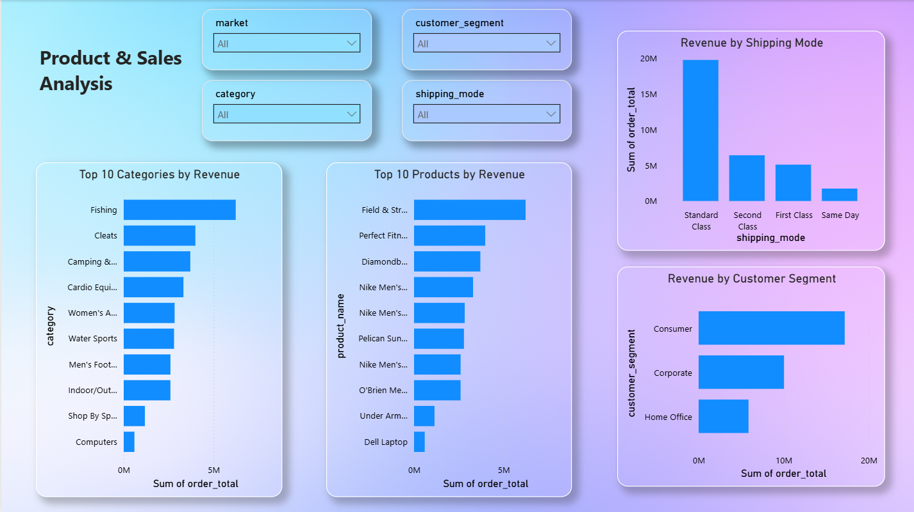
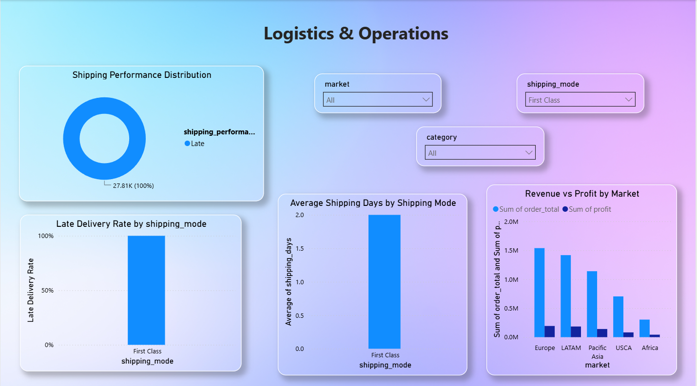

# 📦 Supply Chain & Inventory Analysis

<div align="center">

### End-to-End Data Analytics Project using Python, SQL, Excel & Power BI


</div>

---

# 📌 Project Overview

This project demonstrates a complete end-to-end Supply Chain Analytics workflow using the **DataCo Global Supply Chain Dataset**.

The objective was to transform raw operational and sales data into meaningful business insights by combining **Python, SQL, Excel and Power BI** into a single analytics pipeline.

The project follows a real-world workflow:

- Data Cleaning & Preprocessing
- Feature Engineering
- SQLite Database Creation
- SQL Business Analysis
- Excel Reporting
- Interactive Power BI Dashboard

The final solution enables business users to monitor sales performance, logistics efficiency, inventory trends, shipping operations and customer segments through interactive dashboards.

---

# 🎯 Business Problem

Large supply chain organizations generate massive amounts of operational data every day, making it difficult to identify inefficiencies and optimize performance.

This project answers questions such as:

- Which markets generate the highest revenue?
- Which product categories contribute the most sales?
- Which shipping modes are most efficient?
- How does revenue change throughout the year?
- Which customer segments generate the highest revenue?
- How effective are logistics and delivery operations?

---

# 📂 Dataset

**Dataset:** DataCo SMART SUPPLY CHAIN FOR BIG DATA ANALYSIS

The DataCo SMART Supply Chain for Big Data Analysis dataset is a real-world supply chain dataset designed for business intelligence and analytics. It contains operational, sales and logistics information across multiple markets, product categories and shipping methods, making it ideal for supply chain optimization and inventory analytics.

The dataset contains information about:

- Orders
- Customers
- Products
- Product Categories
- Markets
- Shipping Modes
- Customer Segments
- Revenue & Profit
- Logistics Performance

Dataset Highlights:

- 65,000+ Orders
- 20,000+ Customers
- Global Market Coverage
- Multiple Product Categories
- Shipping Information
- Revenue & Profit Metrics
- Logistics Performance Data

---

# 🛠 Tech Stack

| Category             | Technologies       |
| -------------------- | ------------------ |
| Programming          | Python             |
| Data Processing      | Pandas, NumPy      |
| Database             | SQLite             |
| Query Language       | SQL                |
| Spreadsheet Analysis | Microsoft Excel    |
| Dashboarding         | Microsoft Power BI |
| Version Control      | Git & GitHub       |

---

# 🔄 Project Workflow

```text
Raw CSV Files
      │
      ▼
Python Data Cleaning
      │
      ▼
Feature Engineering
      │
      ▼
SQLite Database
      │
      ▼
SQL Business Analysis
      │
      ▼
Excel Analysis
      │
      ▼
Power BI Dashboard
      ▼
Business Insights
```

---

# 📈 Analytics Pipeline

The project follows an end-to-end analytics workflow commonly used in supply chain and business intelligence projects.

1. Clean raw supply chain data using Python.
2. Store processed data inside SQLite.
3. Perform SQL-based business analysis.
4. Perform Excel Pivot Table analysis.
5. Build interactive Power BI dashboards.
6. Analyze logistics and shipping performance.
7. Deliver actionable business insights.

---

# 📈 Python Visualizations (Plotly)

Python was used to automate business reporting by generating interactive visualizations directly from SQL query results using **Plotly**.

These visualizations provide quick insights into revenue performance, customer behaviour, product sales, payment methods and order fulfillment before building the final Power BI dashboard.

---

## Top 10 Product Categories by Revenue

Analyzes the highest revenue-generating product categories across the business.

This visualization helps identify which product categories contribute the most to overall sales and can be used to support inventory planning, marketing campaigns and category-level investment decisions.



---

## Monthly Revenue Trend

Shows how revenue changes over time, highlighting seasonal demand patterns and business growth trends.

This visualization helps stakeholders monitor monthly sales performance, identify peak sales periods and evaluate overall business performance throughout the year.


---

## Top 10 Customers by Revenue

Identifies the highest-value customers based on total revenue generated.

Understanding top customers enables businesses to improve customer relationship management, design loyalty programs and focus retention efforts on high-value accounts.


---

## Payment Method Distribution

Displays the distribution of customer payment methods across all completed orders.

This analysis helps businesses understand customer payment preferences and optimize payment processing strategies while identifying opportunities to promote preferred payment options.


---

## Order Status Distribution

Provides an overview of order fulfillment by comparing different order statuses such as delivered, shipped, cancelled and processing.

This visualization helps operations teams monitor fulfillment efficiency, identify bottlenecks and improve overall supply chain performance.


---

## Top 10 Products by Revenue

Ranks the highest revenue-generating individual products across the business.

This analysis helps identify best-selling products, optimize inventory allocation and support pricing, procurement and merchandising decisions.


---

# 📊 Microsoft Excel Analysis

Microsoft Excel was used to validate key business KPIs through **Pivot Tables**, **Pivot Charts** and **Interactive Slicers**, providing an additional layer of business reporting alongside Python, SQL and Power BI.

The Excel workbook demonstrates sales, customer and logistics analysis using multiple business dimensions and supports the findings presented in the Power BI dashboard.

---

## Revenue & Sales Performance Analysis

This worksheet analyzes revenue across multiple business dimensions using Pivot Tables and Pivot Charts.

The dashboard includes:

- Revenue by Product Category
- Revenue by Market
- Revenue by Shipping Mode
- Revenue by Customer Segment
- Monthly Revenue Trend

These reports help compare sales performance across markets, customer groups and shipping methods while identifying top-performing categories and seasonal trends.



---

## Shipping & Operational Performance Analysis

This worksheet focuses on logistics and operational efficiency using Pivot Tables, Pivot Charts and Interactive Slicers.

The dashboard includes:

- Shipping Performance Distribution
- Order Delivery Performance
- Interactive Filters for:
  - Market
  - Customer Segment
  - Shipping Mode
  - Order Year

These reports enable users to analyze operational performance dynamically across different business dimensions and evaluate delivery efficiency.



---

### Excel Skills Demonstrated

- Pivot Tables
- Pivot Charts
- Interactive Slicers
- Business Reporting
- Sales Performance Analysis
- Supply Chain Analysis
- Customer Segmentation
- Logistics Performance Monitoring

---

### Why Multiple Tools?

Instead of relying on a single platform, the same business questions were answered using multiple analytical tools.

This approach demonstrates the ability to perform consistent analysis across:

- Python
- SQL
- Microsoft Excel
- Power BI

while ensuring that all reported KPIs remain accurate, reproducible and suitable for executive business reporting.

# 📊 Interactive Power BI Dashboard

The final stage of the project was the development of a multi-page interactive Power BI dashboard.

The dashboard transforms raw supply chain and sales data into executive-level business reports, enabling organizations to monitor sales performance, evaluate logistics operations, analyze customer behaviour and support data-driven supply chain decisions.

---

# Dashboard Overview

The report is divided into three analytical pages.

---

## 📦 Supply Chain & Inventory Analytics Dashboard

Provides a high-level overview of overall business performance by combining sales, profit and logistics KPIs into a single executive dashboard.

**Key Metrics**

- Total Revenue
- Total Orders
- Total Profit
- Average Shipping Days
- Late Delivery Rate

**Highlights**

- Revenue by Market
- Monthly Revenue Trend
- Interactive Filters for Customer Segment
- Market Selection
- Monthly Performance Analysis



---

## 🛍 Product & Sales Analysis

Analyzes product performance, customer segments and sales distribution across different business dimensions.

**Key Metrics**

- Revenue by Product Category
- Revenue by Product
- Revenue by Shipping Mode
- Revenue by Customer Segment

**Highlights**

- Top 10 Product Categories by Revenue
- Top 10 Products by Revenue
- Customer Segment Analysis
- Shipping Mode Performance
- Interactive Product Filters



---

## 🚚 Logistics & Operations

Evaluates operational efficiency by analyzing shipping performance, delivery delays and profitability across different markets.

**Key Metrics**

- Shipping Performance
- Average Shipping Days
- Revenue
- Profit

**Highlights**

- Shipping Performance Distribution
- Late Delivery Rate by Shipping Mode
- Average Shipping Days by Shipping Mode
- Revenue vs Profit by Market
- Interactive Logistics Filters



---

# ✨ Dashboard Features

The dashboard supports interactive supply chain analysis through:

- Dynamic KPI Cards
- Interactive Slicers
- Cross-filtering
- Drill-down Analysis
- Multi-page Navigation
- Executive Business Reporting

---

# 💡 Key Business Insights

The analysis produced the following business insights.

### 📌 1. The business generated approximately **₹33.05 Million** in revenue from more than **65,000 customer orders**, demonstrating a large-scale retail operation.

---

### 📌 2. **Europe** generated the highest overall revenue, followed closely by **LATAM**, making these the company's strongest performing markets.

---

### 📌 3. The **Consumer** customer segment contributed the largest share of total revenue, significantly outperforming Corporate and Home Office customers.

---

### 📌 4. **Standard Class** shipping accounted for the majority of total revenue, indicating that customers generally prefer economical shipping options over premium delivery services.

---

### 📌 5. Categories such as **Fishing**, **Cleats**, **Camping & Hiking**, and **Cardio Equipment** generated the highest revenue, making them the primary drivers of product sales.

---

### 📌 6. A small group of products and customers contributed a disproportionately large share of total revenue, highlighting opportunities for customer retention, cross-selling and inventory optimization.

---

### 📌 7. Monthly revenue remained relatively stable throughout the year with noticeable seasonal fluctuations, helping identify periods of stronger and weaker business performance.

---

### 📌 8. Shipping performance analysis revealed opportunities to reduce delivery delays, optimize shipping methods and improve operational efficiency while maintaining profitability.

# 🎯 Business Value

This project enables organizations to:

- Monitor overall sales performance
- Track revenue and profit across global markets
- Identify top-performing products and categories
- Analyze customer purchasing behaviour
- Evaluate shipping performance and delivery efficiency
- Monitor logistics operations across shipping modes
- Optimize inventory planning using sales insights
- Support data-driven supply chain and business decisions

---

# 🚀 Getting Started

## Clone the Repository

```bash
git clone https://github.com/KartikeyaWarhade2002/supply-chain-inventory-analytics.git
```

Move into the project directory:

```bash
cd supply-chain-inventory-analytics
```

---

## Create a Virtual Environment

### Windows

```bash
python -m venv .venv
```

Activate the environment:

```bash
.venv\Scripts\activate
```

---

## Install Dependencies

```bash
pip install -r requirements.txt
```

---

# ▶️ Running the Project

Execute the scripts in the following order.

### 1. Prepare the Dataset

```bash
python scripts/prepare_data.py
```

### 2. Execute SQL Analysis

```bash
python sql/analysis.py
```

### 3. Generate Plotly Charts

```bash
python scripts/charts.py
```

### 4. Prepare Excel Dataset

```bash
python scripts/prep_excel.py
```

### 5. Prepare Power BI Dataset

```bash
python scripts/prep_powerbi.py
```

### 6. Launch the Streamlit Dashboard

```bash
streamlit run dashboard/app.py
```

### 7. Open the Power BI Report

Open the following file using **Microsoft Power BI Desktop**.

```text
powerbi/supply_chain_analytics.pbix
```

---

# 📌 Project Highlights

✔ End-to-End Supply Chain Analytics Workflow

✔ Python Data Cleaning & Preprocessing

✔ SQLite Database Integration

✔ SQL Business Analysis

✔ Automated Plotly Visualizations

✔ Microsoft Excel Pivot Analysis

✔ Interactive Power BI Dashboard

✔ Supply Chain KPI Development

✔ Sales, Customer & Logistics Analytics

✔ Business Intelligence & Data Storytelling

---

# 📄 License

This project is licensed under the **MIT License**.

---

# 👨‍💻 Author

## Kartikeya Warhade

Aspiring Data Analyst passionate about transforming raw business data into actionable insights using Python, SQL, Excel and Power BI.

### Connect with Me

**GitHub**

https://github.com/KartikeyaWarhade2002

**LinkedIn**

https://www.linkedin.com/in/kartikeya-warhade/

---

<div align="center">

### ⭐ If you found this project useful, consider giving it a Star!

Thank you for visiting the repository.

</div>
